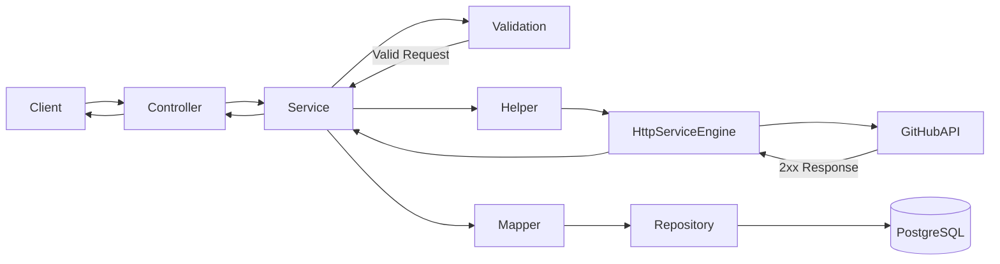
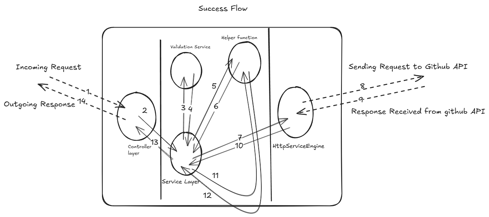
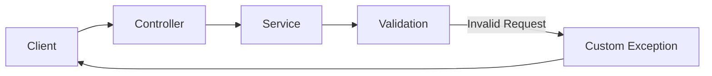
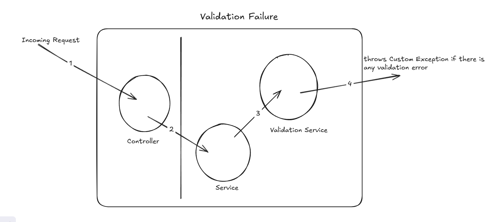
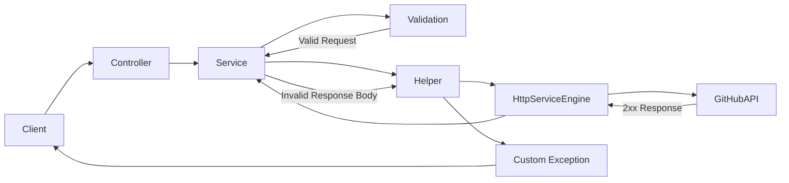
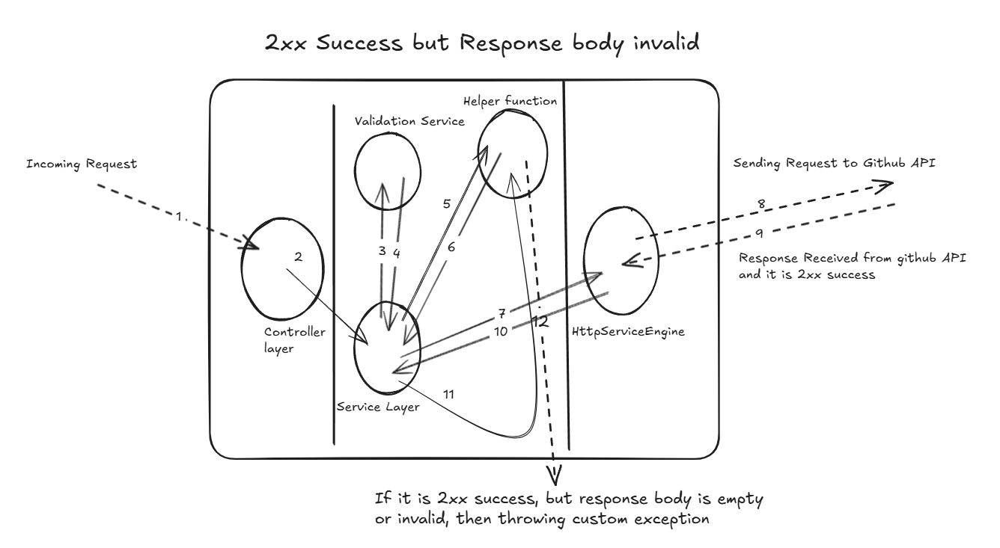
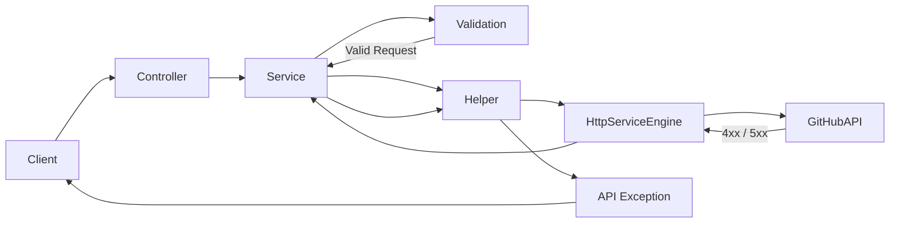
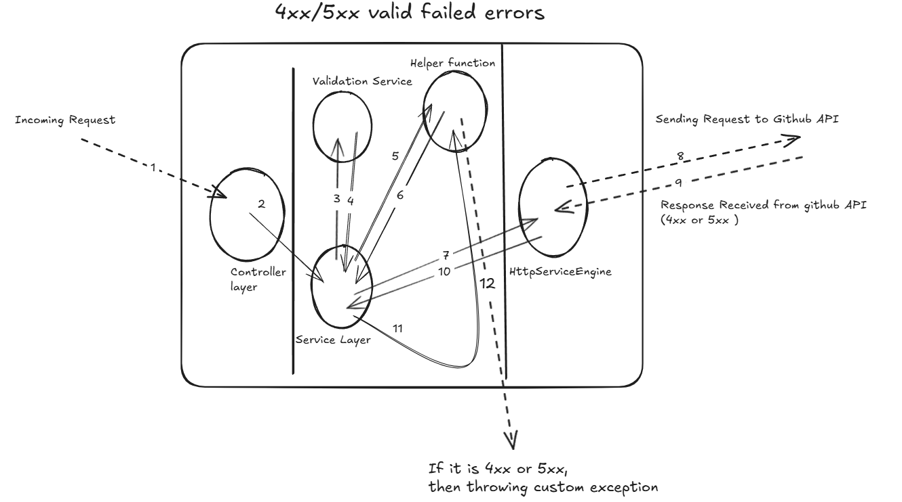
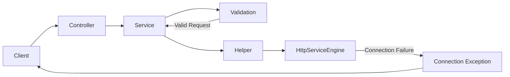
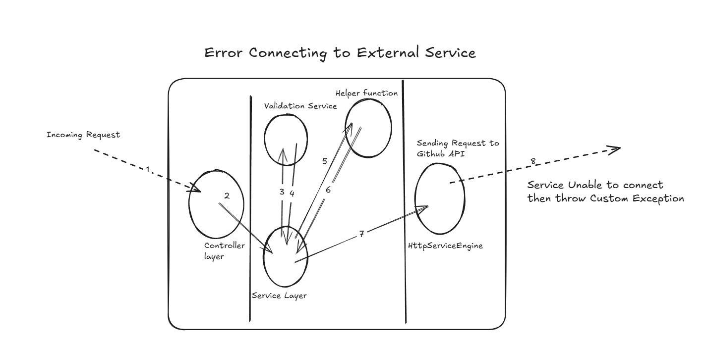

# 🚀 GitHub Repository Searcher


A **Spring Boot REST API** application that integrates with the **GitHub Search API** to fetch repositories based on search criteria and store them in a **PostgreSQL database**.

The service allows users to:

- 🔎 Fetch repositories from GitHub
- 💾 Store repository information in PostgreSQL
- 📦 Retrieve stored repositories through a REST API

This project demonstrates **backend development best practices**, including:

- REST API design
- External API integration
- Database persistence
- Clean layered architecture
- Exception handling
- Environment-based configuration

---

# 📚 Table of Contents

- [Tech Stack](#-tech-stack)
- [Features](#-features)
- [Database Schema](#-database-schema)
- [Project Architecture](#-project-architecture)
- [Application Flow](#-application-flow)
- [Configuration](#-configuration)
- [Folder Structure](#-folder-structure)
- [Running the Project](#-running-the-project)
- [API Contract](#-api-contract)
- [Author](#-author)


# 🛠 Tech Stack

| Technology | Description |
|------------|-------------|
| **Java** | Programming Language |
| **Spring Boot** | Backend Framework |
| **PostgreSQL** | Relational Database |
| **Maven** | Build Tool |
| **GitHub REST API** | External API Integration |

---

# ✨ Features

- Fetch repositories from **GitHub Search API**
- Store repository details in **PostgreSQL**
- Prevent duplicate entries by **updating existing records**
- Retrieve stored repositories via REST API
- Environment-specific configuration using **Spring Profiles**
- Standardized **error handling**
- Clean **layered architecture**

---

# 🌟 Project Highlights

- Clean **layered architecture**
- Robust **exception handling**
- Integration with **external REST API**
- Environment configuration using **Spring Profiles**
- Persistent storage using **PostgreSQL**
- Scalable **service-oriented design**

---

# 🗄 Database Schema

| Field | Description |
|------|-------------|
| id | GitHub repository ID |
| name | Repository name |
| description | Repository description |
| owner | Owner username |
| language | Programming language |
| stars | Star count |
| forks | Fork count |
| lastUpdated | Last updated timestamp |

---

# ⚙️ Configuration

This project uses **Spring Profiles** and **Maven** for managing configuration across environments.

## Spring Profiles

Allows different configurations for:

- local
- dev
- uat
- prod

**application.properties**

```properties
spring.profiles.active=@spring.profiles.active@
spring.application.name=github-provider-service
server.port=8084
````

---

## Environment Specific Configuration

Example: `application-local.properties`

```properties
github.baseurl=https://api.github.com
github.baseurl.path=/search/repositories

spring.datasource.url=jdbc:postgresql://localhost:5432/github_repo_db
spring.datasource.username=YOUR_POSTGRESQL_USERNAME
spring.datasource.password=YOUR_POSTGRESQL_PASSWORD

spring.jpa.hibernate.ddl-auto=update
spring.jpa.show-sql=true
```

---

## Maven Commands

```bash
mvn clean package
mvn clean spring-boot:run
```

Maven handles:

* dependency management
* packaging
* building
* running the application

---

# 📁 Folder Structure

```
src
├── main
│   ├── java
│   │   └── com
│   │       └── mycompany
│   │           └── repositories
│   │               ├── config
│   │               ├── constant
│   │               ├── controller
│   │               ├── dto
│   │               ├── entity
│   │               ├── exception
│   │               ├── github
│   │               ├── http
│   │               ├── mapper
│   │               ├── pojo
│   │               ├── repository
│   │               ├── service
│   │               │   ├── helper
│   │               │   ├── impl
│   │               │   └── interfaces
│   │               └── util
│   └── resources
│       ├── application.properties
│       ├── application-local.properties
│       ├── application-dev.properties
│       ├── application-uat.properties
│       └── application-prod.properties
└── test
```

### Folder Responsibilities

| Folder        | Purpose                      |
| ------------- | ---------------------------- |
| config        | Spring configuration classes |
| controller    | REST API controllers         |
| service       | Business logic layer         |
| repository    | Database access layer        |
| entity        | JPA entities                 |
| dto / pojo    | Data transfer objects        |
| http / github | External API integration     |
| mapper        | Entity/DTO conversion        |
| util          | Utility classes              |

---

# 🔄 Application Flow

This application follows a **layered architecture flow**.

```
Client Request
     ↓
Controller Layer
     ↓
Service Layer
     ↓
Validation Service
     ↓
Helper Layer
     ↓
HTTP Service Engine
     ↓
GitHub REST API
```

The system handles **multiple response scenarios** depending on request validity and GitHub API responses.

---

# ✅ 1. Success Flow



When everything works correctly:

* Request is validated
* GitHub API returns success
* Data is mapped and stored
* Response is returned to the client



---

# ⚠️ 2. Validation Failure



If the client request is **invalid**, the system stops processing before calling the GitHub API.

Examples:

* Missing `query` parameter
* Missing `language`
* Invalid request body

In this case, the **Validation Service throws a custom exception**, and the controller returns an appropriate error response.



---

# ⚠️ 3. 2xx Success but Invalid Response Body



Sometimes the GitHub API may return **2xx success**, but the response body is not usable.

Examples:

* Empty response body
* Invalid JSON structure
* Missing required fields

In this case, the application detects the issue during processing and throws a **custom exception**.



---

# ❌ 4. 4xx / 5xx API Failure



If the GitHub API returns an error status:

* **4xx — Client errors**
* **5xx — Server errors**

The application handles these responses and throws a **custom exception** to maintain consistent error handling.



---

# 🔌 5. External Service Connection Failure



If the application **cannot connect to the GitHub API**, a custom exception is thrown.

Possible reasons include:

* Network failure
* API timeout
* DNS resolution issues
* GitHub service unavailable



---
# 🚀 Running the Project

## 1️⃣ Clone the Repository

```bash
git clone https://github.com/ShubhamKashyap45/github-provider-service.git
cd github-provider-service
```

---

## 2️⃣ Create Main Configuration File

Create:

```
src/main/resources/application.properties
```

Paste the configuration mentioned earlier.

---

## 3️⃣ Create Local Environment Configuration

Create:

```
application-local.properties
```

Update PostgreSQL credentials:

```properties
spring.datasource.username=YOUR_POSTGRESQL_USERNAME
spring.datasource.password=YOUR_POSTGRESQL_PASSWORD
```

---

## 4️⃣ Create PostgreSQL Database

```sql
CREATE DATABASE github_repo_db;
```

---

## 5️⃣ Run the Application

```bash
mvn spring-boot:run
```

Application runs at:

```
http://localhost:8084
```

---

# 📡 API Contract

## Common Headers

```
Accept: application/json
X-GitHub-Api-Version: <version>
```

---

# 🔎 Search GitHub Repositories

### Endpoint

```
POST /api/v1/github/search
```

### Request Body

```json
{
  "query": "spring boot",
  "language": "Java",
  "sort": "stars"
}
```

### Parameters

| Parameter | Required | Description                   |
| --------- | -------- | ----------------------------- |
| query     | Yes      | Repository name               |
| language  | Yes      | Programming language          |
| sort      | No       | Sort by stars, forks, updated |

---

### Success Response

```json
{
  "message": "Repositories fetched and saved successfully",
  "repositories": [
    {
      "id": 123456,
      "name": "spring-boot-example",
      "description": "An example repository for Spring Boot",
      "owner": "user123",
      "language": "Java",
      "stars": 450,
      "forks": 120,
      "lastUpdated": "2024-01-01T12:00:00Z"
    }
  ]
}
```

---

### Error Response Examples

```json
{
  "errorCode": "GHP03-400-02",
  "errorMessage": "Required field 'query' missing in the request body"
}
```

```json
{
  "errorCode": "GHP03-500-000",
  "errorMessage": "An unexpected error occurred. Please try again later"
}
```

---

# 📥 Retrieve Stored Repositories

### Endpoint

```
GET /api/v1/github/repositories
```

### Success Response

```json

  "repositories": [
    {
      "id": 123456,
      "name": "spring-boot-example",
      "description": "An example repository for Spring Boot",
      "owner": "user123",
      "language": "Java",
      "stars": 450,
      "forks": 120,
      "lastUpdated": "2024-01-01T12:00:00Z"
    }
  ]
  
```

---

# 🔑 API Design Elements

| Feature         | Implementation              |
| --------------- | --------------------------- |
| Versioning      | `/api/v1`                   |
| Request Format  | JSON                        |
| Response Format | JSON                        |
| Status Codes    | 200, 400, 500               |
| Error Handling  | Custom Error Codes          |
| Headers         | Accept + GitHub API Version |

---

# 👨‍💻 Author

**Shubham Kashyap**

Backend Developer

Java • Spring Boot • REST APIs • PostgreSQL

GitHub:
[https://github.com/ShubhamKashyap45](https://github.com/ShubhamKashyap45)


